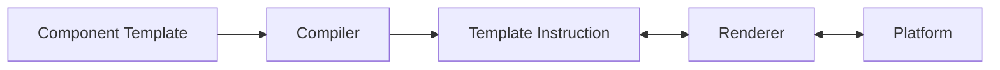
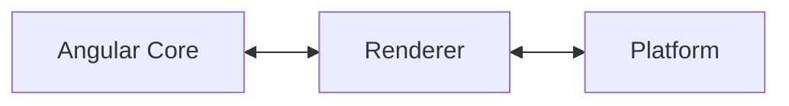

## Agenda

-   Quick review of Angular Renderer
-   Try out the custom Renderer
-   Quick overview of THREE.js and Angular Three

## What is Renderer?

```typescript
@Component({
    /* ... */
})
export class SomeComponent {
    constructor(private readonly renderer: Renderer2) {}
}
```

### Platform Browser

```ts
@Component({
    template: `
        <div>This is inside the div</div>
        <app-parent />
    `,
    imports: [ParentComponent],
})
export class AppComponent {
    title = 'ng-renderer';
}
```

The brigde between Angular Core and your template.





```js
class AppComponent {
  constructor() {
    this.title = 'ng-renderer';
  }
}
AppComponent.ɵfac = function AppComponent_Factory(t) {
  return new (t || AppComponent)();
};
AppComponent.ɵcmp = /*@__PURE__*/_angular_core__WEBPACK_IMPORTED_MODULE_1__["ɵɵdefineComponent"]({
  type: AppComponent,
  selectors: [["app-root"]],
  standalone: true,
  features: [_angular_core__WEBPACK_IMPORTED_MODULE_1__["ɵɵStandaloneFeature"]],
  decls: 3,
  vars: 0,
  template: function AppComponent_Template(rf, ctx) {
    if (rf & 1) {
      _angular_core__WEBPACK_IMPORTED_MODULE_1__["ɵɵelementStart"](0, "div");
      _angular_core__WEBPACK_IMPORTED_MODULE_1__["ɵɵtext"](1, "This is inside the div");
      _angular_core__WEBPACK_IMPORTED_MODULE_1__["ɵɵelementEnd"]();
      _angular_core__WEBPACK_IMPORTED_MODULE_1__["ɵɵelement"](2, "app-parent");
    }
  },
  dependencies: [_parent_component__WEBPACK_IMPORTED_MODULE_0__.Parent],
  encapsulation: 2
});`

```

```js
class Parent {}
Parent.ɵfac = function Parent_Factory(t) {
    return new (t || Parent)();
};
Parent.ɵcmp = /*@__PURE__*/ _angular_core__WEBPACK_IMPORTED_MODULE_0__['ɵɵdefineComponent']({
    type: Parent,
    selectors: [['app-parent']],
    standalone: true,
    features: [_angular_core__WEBPACK_IMPORTED_MODULE_0__['ɵɵStandaloneFeature']],
    decls: 2,
    vars: 0,
    template: function Parent_Template(rf, ctx) {
        if (rf & 1) {
            _angular_core__WEBPACK_IMPORTED_MODULE_0__['ɵɵelementStart'](0, 'h1');
            _angular_core__WEBPACK_IMPORTED_MODULE_0__['ɵɵtext'](1, 'parent');
            _angular_core__WEBPACK_IMPORTED_MODULE_0__['ɵɵelementEnd']();
        }
    },
    encapsulation: 2,
});
```

```js
function ɵɵelementStart(index, name, attrsIndex, localRefsIndex) {
    /* ... */
    const renderer = lView[RENDERER];
    const native = (lView[adjustedIndex] = createElementNode(renderer, name, getNamespace$1()));
    /* ... */
    return ɵɵelementStart;
}

/* ... */

function createElementNode(renderer, name, namespace) {
    ngDevMode && ngDevMode.rendererCreateElement++;
    return renderer.createElement(name, namespace);
}
```

-   Property Binding
-   Attribute Binding
    -   Show Debugger going through this flow instead
-   Event Binding

```html
<div [id]="title" title="my-title" (click)="onClick()">This is inside the div</div>
```

```js
AppComponent.ɵcmp = /*@__PURE__*/ _angular_core__WEBPACK_IMPORTED_MODULE_1__['ɵɵdefineComponent']({
    /* ... */
    consts: [['title', 'my-title', 3, 'id']],
    template: function AppComponent_Template(rf, ctx) {
        if (rf & 1) {
            /* ... */
            _angular_core__WEBPACK_IMPORTED_MODULE_1__['ɵɵelementStart'](0, 'div', 0);
            _angular_core__WEBPACK_IMPORTED_MODULE_1__['ɵɵlistener'](
                'click',
                function AppComponent_Template_div_click_0_listener() {
                    return ctx.onClick();
                }
            );
            /* ... */
        }
        if (rf & 2) {
            _angular_core__WEBPACK_IMPORTED_MODULE_1__['ɵɵproperty']('id', ctx.title);
        }
    },
    /* ... */
});
```

## Renderer API

```typescript
export declare abstract class Renderer2 {
    abstract get data(): {
        [key: string]: any;
    };
    abstract destroy(): void;
    abstract createElement(name: string, namespace?: string | null): any;
    abstract createComment(value: string): any;
    abstract createText(value: string): any;
    destroyNode: ((node: any) => void) | null;
    abstract appendChild(parent: any, newChild: any): void;
    abstract insertBefore(parent: any, newChild: any, refChild: any, isMove?: boolean): void;
    abstract removeChild(parent: any, oldChild: any, isHostElement?: boolean): void;
    abstract selectRootElement(selectorOrNode: string | any, preserveContent?: boolean): any;
    abstract parentNode(node: any): any;
    abstract nextSibling(node: any): any;
    abstract setAttribute(el: any, name: string, value: string, namespace?: string | null): void;
    abstract removeAttribute(el: any, name: string, namespace?: string | null): void;
    abstract addClass(el: any, name: string): void;
    abstract removeClass(el: any, name: string): void;
    abstract setStyle(el: any, style: string, value: any, flags?: RendererStyleFlags2): void;
    abstract removeStyle(el: any, style: string, flags?: RendererStyleFlags2): void;
    abstract setProperty(el: any, name: string, value: any): void;
    abstract setValue(node: any, value: string): void;
    abstract listen(
        target: 'window' | 'document' | 'body' | any,
        eventName: string,
        callback: (event: any) => boolean | void
    ): () => void;
}
```

## Create Custom Renderer

-   `RendererFactory2`
-   `Renderer`
    -   Use a delegate Renderer

## How to provide Custom Renderer

-   Environment Injector / Module Injector
    -   `bootstrapApplication()`
        -   `AppModule#providers`
    -   `Route#providers`
        -   `FeatureModule#providers`
    -   `ViewContainerRef#createComponent()`
        -   `ngModuleRef` (I think for NgModule API)

## Let's create our Custom Renderer for THREE.js

-   Try THREE.js example
    -   Show Angular DevTools
-   Move THREE.js to `canvas.service`
-   Slowly adding in the pieces
    -   `createElement`
    -   `appendChild`
    -   `setAttribute`
    -   `setProperty`
-   `beforeRender()` for animation
    -   `listen`
-   (if have time) show Structural Directive
