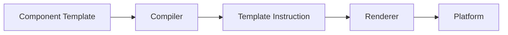
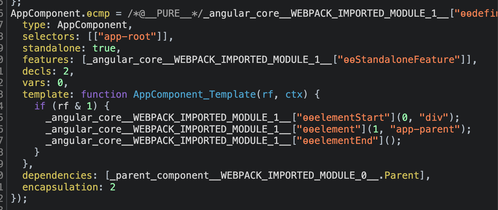
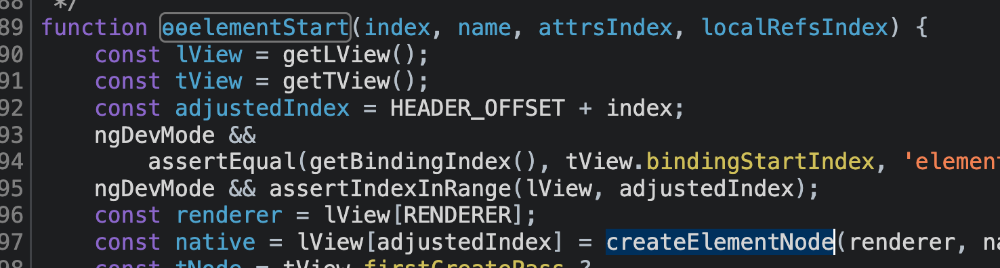
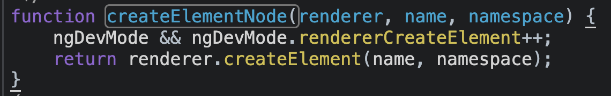

## Agenda

- Quick review of Angular Renderer
- Try out the custom Renderer
- Quick overview of THREE.js and Angular Three

## What is Renderer?

```typescript
@Component({
  /* ... */
})
export class SomeComponent {
  constructor(private readonly renderer: Renderer2) {}
}
```

### Platform Browser

```html
<div>
  <app-parent />
</div>
```

The brigde between Angular Core and your template.









- Property Binding
- Attribute Binding
- Event Binding

## Renderer API

```typescript
export declare abstract class Renderer2 {
  abstract get data(): {
    [key: string]: any;
  };
  abstract destroy(): void;
  abstract createElement(name: string, namespace?: string | null): any;
  abstract createComment(value: string): any;
  abstract createText(value: string): any;
  destroyNode: ((node: any) => void) | null;
  abstract appendChild(parent: any, newChild: any): void;
  abstract insertBefore(
    parent: any,
    newChild: any,
    refChild: any,
    isMove?: boolean
  ): void;
  abstract removeChild(
    parent: any,
    oldChild: any,
    isHostElement?: boolean
  ): void;
  abstract selectRootElement(
    selectorOrNode: string | any,
    preserveContent?: boolean
  ): any;
  abstract parentNode(node: any): any;
  abstract nextSibling(node: any): any;
  abstract setAttribute(
    el: any,
    name: string,
    value: string,
    namespace?: string | null
  ): void;
  abstract removeAttribute(
    el: any,
    name: string,
    namespace?: string | null
  ): void;
  abstract addClass(el: any, name: string): void;
  abstract removeClass(el: any, name: string): void;
  abstract setStyle(
    el: any,
    style: string,
    value: any,
    flags?: RendererStyleFlags2
  ): void;
  abstract removeStyle(
    el: any,
    style: string,
    flags?: RendererStyleFlags2
  ): void;
  abstract setProperty(el: any, name: string, value: any): void;
  abstract setValue(node: any, value: string): void;
  abstract listen(
    target: "window" | "document" | "body" | any,
    eventName: string,
    callback: (event: any) => boolean | void
  ): () => void;
}
```

## Create Custom Renderer

- `RendererFactory2`
- `Renderer`
  - Use a delegate Renderer

## How to provide Custom Renderer

- Environment Injector
  - `bootstrapApplication()`
  - `Route#providers`
  - `ViewContainerRef#createComponent()`
